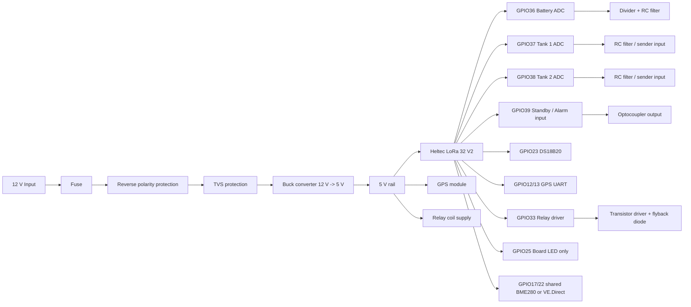

# Hardware Improvement Proposal

This document captures practical hardware improvements for the currently built device based on:

- [Gunnis_mod.pdf](/Users/guntmar/Documents/PlatformIO/Projects/LoRa-Boat-Monitor/project/cad/Gunnis_mod.pdf)
- [LoRa-Bootsmonitor_3.sch](/Users/guntmar/Documents/PlatformIO/Projects/LoRa-Boat-Monitor/project/cad/Eagle/LoRa-Bootsmonitor_3.sch)
- [hardware-current-setup.md](/Users/guntmar/Documents/PlatformIO/Projects/LoRa-Boat-Monitor/project/docs/hardware-current-setup.md)

The goal is not a full redesign. The focus is a cleaner and more robust next revision for boat use.

## Current assessment

The current design is workable and matches the firmware well enough for:

- battery voltage measurement
- tank level measurement
- GPS
- standby/alarm input
- relay output
- DS18B20

The biggest weak points are not basic functionality, but robustness and clarity:

- `GPIO25` is shared by the relay output and the Heltec on-board LED
- BME280 and VE.Direct share the same pins and rely on configuration discipline
- the 12 V input should be treated as a noisy automotive / marine supply
- the ADC inputs would benefit from additional filtering and protection

## Recommended priority

## Priority 1: Highly recommended

### 1. Separate relay output from the on-board LED

Current state:

- `GPIO25` drives both the Heltec LED and the relay signal

Why it is not ideal:

- every relay action toggles the LED
- any future LED debug function would also toggle the relay
- the signal is harder to reason about during diagnostics

Recommendation:

- keep `GPIO25` for the board LED only
- move the relay driver input to a dedicated GPIO
- preferred candidates on Heltec V2: `GPIO32` or `GPIO33`

Suggested result:

- `GPIO25` = LED only
- `GPIO33` = relay output

### 2. Harden the 12 V input against boat power disturbances

Boat and automotive-style supplies are often noisy and can produce:

- reverse polarity mistakes
- alternator spikes
- load dump style peaks
- relay and motor transients

Recommendation:

- add an input fuse
- add reverse polarity protection
- add a TVS diode at the 12 V input
- keep the buck converter close to the power entry
- add clear input and output bulk capacitance near the buck regulator

Preferred topology:

- fuse
- reverse polarity protection with P-channel MOSFET or Schottky if simplicity is preferred
- TVS diode to GND
- buck converter

### 3. Add filtering and protection to the ADC inputs

Affected signals:

- battery voltage
- tank 1
- tank 2

Why:

- long wires and tank senders are sensitive to noise
- ESP32 ADCs are already imperfect
- a small amount of filtering often improves real stability a lot

Recommendation:

- add a small series resistor before each ADC pin
- add a capacitor from ADC pin to GND
- verify that the resistor divider for the battery input keeps the ADC safely below 3.3 V at worst-case battery voltage

Typical starting point:

- series resistor: `1k` to `4.7k`
- capacitor to GND: `10nF` to `100nF`

### 4. Keep the standby/alarm input protected

Current state:

- standby and alarm use the same input
- signal is active-low
- the schematic already uses optocoupler isolation

Recommendation:

- keep the optocoupler approach
- verify input resistor sizing for real 12 V operation
- add clear documentation that the standby signal is active-low
- consider adding a test point for the MCU-side signal

## Priority 2: Nice improvements

### 5. Make BME280 and VE.Direct selection explicit in hardware

Current state:

- both use the same pins
- this is acceptable because they are not used at the same time

Recommendation:

- keep the shared pins if board area matters
- add either:
  - a small solder jumper selection
  - or a header note in the schematic
  - or explicit DNP marking for the unused option

This avoids confusion when the design is opened later.

### 6. Improve relay driver robustness

Recommendation:

- verify flyback diode placement directly across the relay coil
- keep the transistor base resistor explicit and documented
- if the relay cable leaves the PCB, consider additional suppression depending on wiring length

### 7. Add test points

Recommended test points:

- `12V_IN`
- `5V`
- `GND`
- `BAT_ADC`
- `TANK1_ADC`
- `TANK2_ADC`
- `STANDBY_IN_MCU`
- `RELAY_OUT`
- `GPS_TX`
- `GPS_RX`

This makes bring-up and fault finding much easier.

## Proposed vNext pin assignment

This keeps firmware and hardware easy to understand.

| Function | Current | Proposed vNext |
|---|---:|---:|
| Board LED | GPIO25 | GPIO25 |
| Relay output | GPIO25 | GPIO33 |
| Battery ADC | GPIO36 | GPIO36 |
| Tank 1 ADC | GPIO37 | GPIO37 |
| Tank 2 ADC | GPIO38 | GPIO38 |
| Standby / alarm input | GPIO39 | GPIO39 |
| DS18B20 | GPIO23 | GPIO23 |
| GPS RX/TX | GPIO12 / GPIO13 | GPIO12 / GPIO13 |
| BME280 / VE.Direct shared pins | GPIO17 / GPIO22 | GPIO17 / GPIO22 |

## Draft revised schematic structure

This is not yet a full CAD redraw. It is the intended electrical structure for the next revision.

## Suggested CAD changes for the next schematic revision

In the Eagle schematic:

- rename `OUT1` or relay net so it no longer implies shared LED use
- show `GPIO25` as `LED_STATUS` only if relay is moved away
- if relay remains on `GPIO25`, annotate that it is intentionally shared
- add a power-entry block:
  - fuse
  - reverse polarity protection
  - TVS
- add RC filters on ADC nets
- mark BME280 as optional / DNP if not fitted
- annotate VE.Direct and BME280 as mutually exclusive

## Practical recommendation

If only one hardware revision is done soon, the best return on effort is:

1. move relay off `GPIO25`
2. improve 12 V input protection
3. add RC filtering to battery and tank ADC inputs

These three changes bring the biggest practical gain with the least redesign risk.
